# tangoAW2

Rollback netplay for **Advance Wars 2: Black Hole Rising** (GBA, USA), with
everything unlocked, **Black Hole as a playable army on any map**,
**five-army battles**, Black Hole's inventions in the Design Room, and, as
a hidden extra, Dual Strike's **Black Crystal and Black Obelisk**.

tangoAW2 is a fork of [Tango](https://github.com/tangobattle/tango) by the
Tango developers. It keeps Tango's emulator (mGBA), rollback engine, lobby
and networking, and adds Advance Wars 2 on top.

No game is included. You need your own copy of the cartridge dumped to a
`.gba` file.

<table>
<tr>
<td>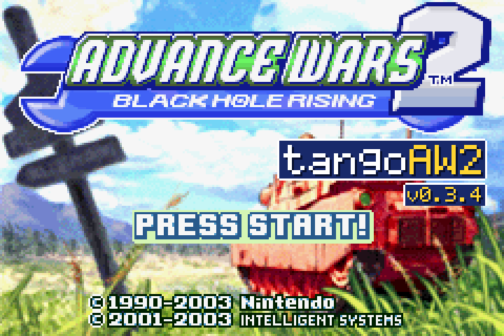</td>
<td>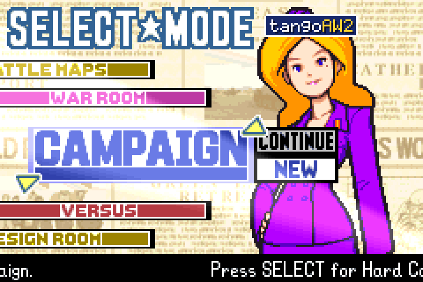</td>
</tr>
</table>

## New in 0.2.1

- **Black Rampart**, a new 5P map in the campaign's style: Black Hole's
  fortress at the top behind a pipe wall, with a Black Factory,
  minicannons and a Deathray in the middle of the top edge that fires
  down the whole map. See [Five armies](#five-armies-5p-maps).
- **Black Monolith** (with the Dual Strike art) gets more cities for every
  army, more neutral cities, neutral airports and roads.

## New in 0.2.0

- **Five armies on one map.** A **5P Maps** tab in Versus: Orange Star,
  Blue Moon, Green Earth, Yellow Comet and Black Hole all at once, each a
  person or the computer, offline and online. Six new maps: a sea war, a
  land war, a volcano, an air war, a siege, and Black Rampart, a
  campaign-style fortress with a Deathray firing down the middle. See
  [Five armies](#five-armies-5p-maps).
- **Hidden feature: the Black Crystal and Black Obelisk** from Advance
  Wars: Dual Strike. Black Hole structures that heal and resupply Black
  Hole's units, on four new maps (2, 3, 4 and 5 armies) and in the Design
  Room. They unlock only if you load your own Dual Strike `.nds` once. See
  [Black Crystal and Black Obelisk](#black-crystal-and-black-obelisk).

## What it does

- **Rollback netplay.** Both players run the same emulated Game Boy
  Advance in the game's own Versus mode. Your button presses show up
  instantly. If your friend's input arrives late, the game quietly
  rewinds a few frames and replays them with the right input.
- **Turns are enforced.** On the battlefield only the player whose army
  is moving can press anything. In menus (map select, CO select, rules,
  the "Next turn" screen) both players can press. With fog of war on,
  the waiting player's screen goes dark during the other army's turn.
- **Everything unlocked.** Every CO including Sturm, every CO colour
  edit, every Battle Map, Hard Campaign and the Sound Room. This is
  applied while the game runs, like Slippi's codes for Melee, so the ROM
  file is never modified. Save in-game and it sticks.
- **Any army, any colour.** On Versus' **Teams** screen, move to an army
  and press **SELECT** (or **R**) to change its colour, **L** to go back:
  Orange Star, Blue Moon, Yellow Comet, Green Earth and **Black Hole**,
  each with its own emblem. It works on every map, team (alliance) games
  included, online and offline. Units, buildings, HQs and banners take the
  picked army's colours; Campaign and War Room keep their story armies.
- **Five armies on one map** (new). See [Five armies](#five-armies-5p-maps).
- **Black Hole in the Design Room.** Build maps with a Black Hole army and
  Black Hole's inventions (minicannons, laser, Black Cannons, Black
  Factory, Volcano and Deathray), each picked from the terrain bar and
  shown as it looks in battle. See [Design Room](#design-room-black-hole-and-its-inventions).
- **Play as Black Hole with its inventions.** The Black Factory deploys
  units for you and the Deathray fires on your enemies, like in the
  campaign, offline and online. See [inventions in battle](#black-holes-inventions-in-battle).
- **Hidden: Black Crystal and Black Obelisk** (new), if you load your own
  Dual Strike ROM. See [Black Crystal and Black Obelisk](#black-crystal-and-black-obelisk).
- **tangoAW2 on the title screen and the main menu**, so you can tell at a
  glance you're in tangoAW2. The game draws it as part of its own picture;
  your ROM file is unchanged.
- **Play offline** without a connection, or online with a friend through a
  link code or a direct connection.

<table>
<tr>
<td></td>
<td></td>
</tr>
<tr>
<td align="center">Black Hole against Orange Star, picked with SELECT</td>
<td align="center">That battle: Black Hole's army and buildings</td>
</tr>
<tr>
<td></td>
<td></td>
</tr>
<tr>
<td align="center">Black Hole as the fourth army</td>
<td align="center">A three-army battle, starting at Black Hole's HQ</td>
</tr>
</table>

## Get it

Download the latest build for your system from
[Releases](https://github.com/rkoh46/tangoAW2/releases):

| System | File |
| --- | --- |
| Windows 10/11 | `tangoaw2-x86_64-windows.exe` (installer) |
| macOS (Apple Silicon and Intel) | `tangoaw2-macos.dmg` |
| Linux | `tangoaw2-x86_64-linux.AppImage` |

On macOS the app is not signed. The first time, right-click it and choose
Open.

## First run

1. Open tangoAW2 and pick a nickname.
2. Put your Advance Wars 2 file in the `roms` folder the welcome screen
   shows. It must be the USA cartridge (No-Intro
   `Advance Wars 2 - Black Hole Rising (USA)`, CRC32 `5AD0E571`).
3. That's it. tangoAW2 selects the game and creates a blank save for you
   the first time. Everything is unlocked anyway.
4. Optional: put your Advance Wars: Dual Strike `.nds` in the same folder
   to unlock the hidden [Black Crystal and Black Obelisk](#black-crystal-and-black-obelisk).

## Playing alone

Press **Play offline** on the Play tab. The game starts straight away, with
everything unlocked, and needs no internet connection. Campaign, War Room,
Versus against the computer and the Design Room all work.

In Versus, change any army's colour on the Teams screen with **SELECT**
(or **R**, and **L** to go back). Each army starts in the map's own colour.
For Black Hole's HQ and units too, give the army a Black Hole CO (Flak,
Lash, Adder, Hawke or Sturm).

## Five armies (5P maps)

Versus has a **5P Maps** tab (press **L** or **LEFT** on the map list's
tab, it sits just before Classic) with six maps, seven with the
[Dual Strike art](#black-crystal-and-black-obelisk). Its maps have all five armies:
Orange Star, Blue Moon, Green Earth, Yellow Comet and **Black Hole**.

<table>
<tr>
<td>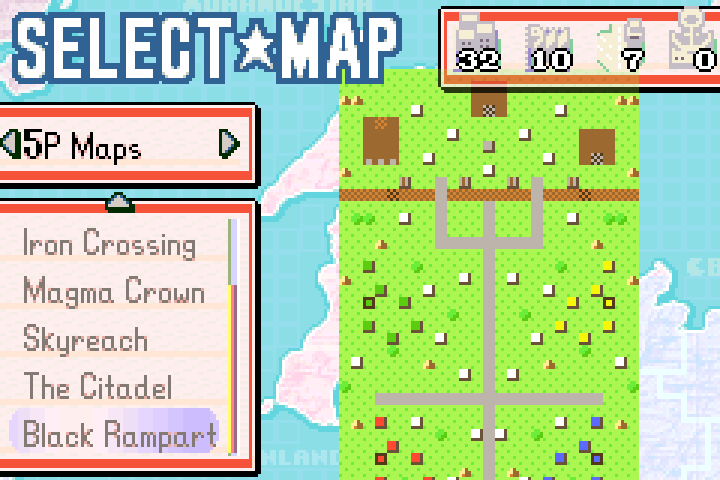</td>
<td>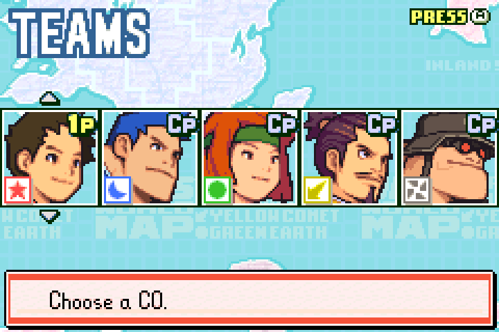</td>
</tr>
<tr>
<td align="center">The 5P Maps tab</td>
<td align="center">Five armies on the Teams screen</td>
</tr>
</table>

| Map | Size | What it is |
| --- | --- | --- |
| **Five Seas** | 20 x 40 | A tall sea map. Each army has an island with a port, and starts with a Battleship, Cruiser, Submarine and Lander. Black Hole's island in the middle has Black Cannons facing north and south. |
| **Iron Crossing** | 30 x 30 | A land war. Four armies hold the corners, walled by mountain ridges with passes; Black Hole holds a fortress in the centre ringed by minicannons. Tanks, Artillery, Recons and Infantry. |
| **Magma Crown** | 30 x 30 | A ring island round an inner sea. Black Hole holds the central isle and its **Volcano**, which rains fire on the map. Landers and Cruisers carry the fight across the water. |
| **Skyreach** | 32 x 36 | An air war. Five plateaus cut off by mountains; every army has three airports and starts with a Fighter, a Bomber, two Battle Copters, Anti-Air and Missiles. Black Cannons guard Black Hole's plateau. |
| **The Citadel** | 28 x 27 | A siege. Black Hole's fortress has a **Black Factory**, the **Deathray** covering the approach, a laser and a row of minicannons. The other four armies start along the bottom and storm it. |
| **Black Rampart** | 25 x 36 | A campaign-style fortress map. Black Hole holds the top behind a **pipe wall** with two breakable seams and two gates, with a **Black Factory**, a Black Cannon and minicannons facing down over the wall. Its **Deathray** sits in the middle of the top edge and fires straight down the central road to the bottom. Green Earth and Yellow Comet attack from the flanks, Orange Star and Blue Moon from the bottom corners. |
| **Black Monolith** (with the Dual Strike art) | 30 x 30 | Four armies in the corners, Black Hole in the middle round a **Black Obelisk**, with four Black Crystals and a minicannon on each side. Every army has five cities (Black Hole four), roads run from each corner round the fortress, and 36 neutral cities and four airports are up for grabs. See [below](#black-crystal-and-black-obelisk). |

**Teams.** All five armies are on the Teams screen. Pick each army's CO
with **UP/DOWN**, and move to the marker in its corner to switch it
between a person (**1P** to **5P**) and the computer (**CP**). On the next
screen, alliances go from **A** to **E Team**. Black Hole plays with its
own units, HQ and buildings; the army colours are fixed on 5P maps.

<table>
<tr>
<td>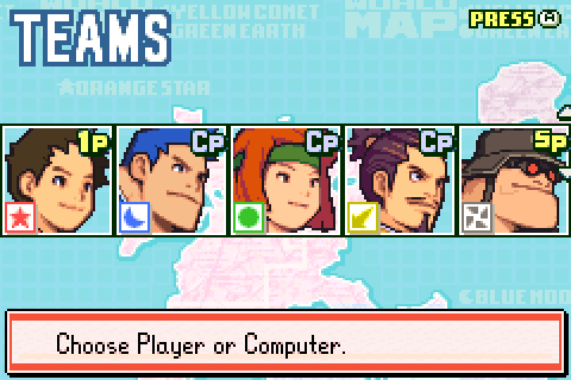</td>
<td>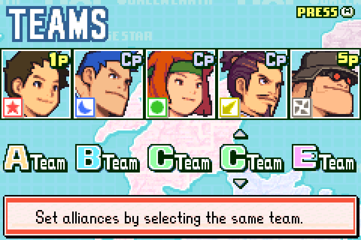</td>
</tr>
<tr>
<td align="center">Black Hole played by a person (5P)</td>
<td align="center">Alliances: A to E Team</td>
</tr>
</table>

**Playing.** Turns go Orange Star, Blue Moon, Green Earth, Yellow Comet,
Black Hole. Several people can share one console (hot seat), each playing
their own army's turn. The map menu's **CO** screen and
**Intel** show all five armies. There is no **Save** in a 5-army battle
(a suspended game holds four armies); everything else, fog of war,
weather, CO Powers, capture and turn limits, works as usual.

<table>
<tr>
<td>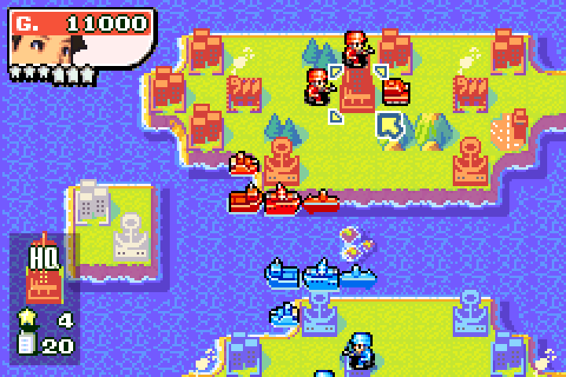</td>
<td>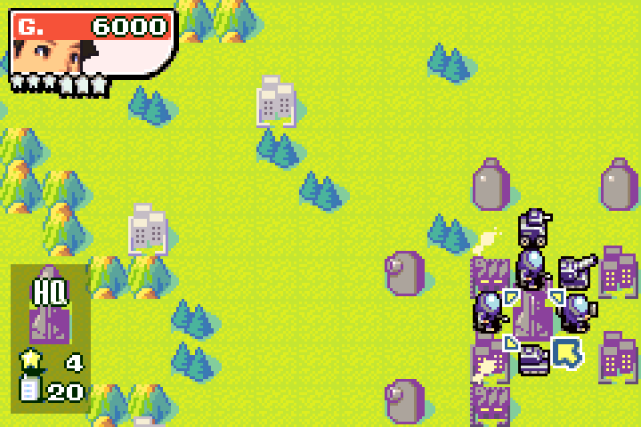</td>
</tr>
<tr>
<td align="center">Five Seas</td>
<td align="center">Iron Crossing</td>
</tr>
<tr>
<td>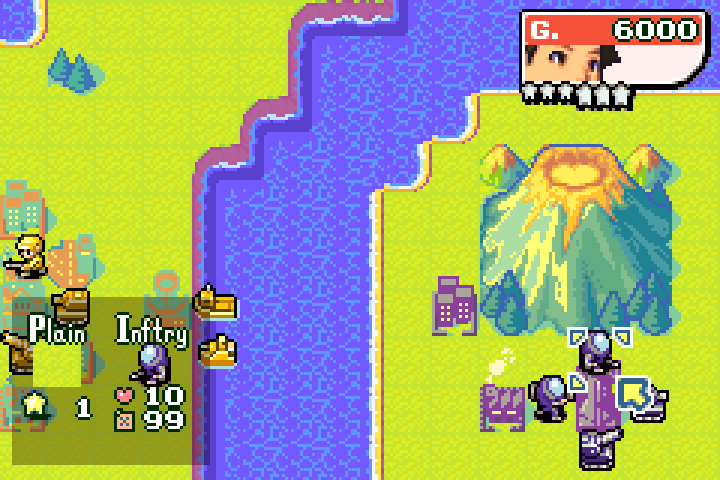</td>
<td>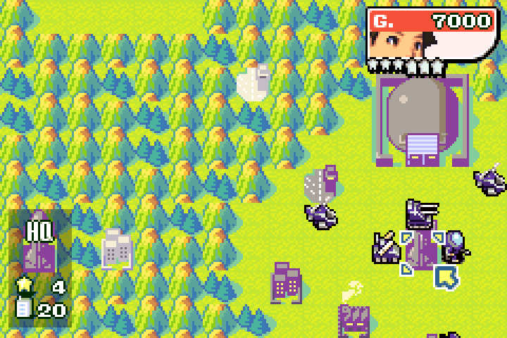</td>
</tr>
<tr>
<td align="center">Magma Crown</td>
<td align="center">Skyreach</td>
</tr>
<tr>
<td>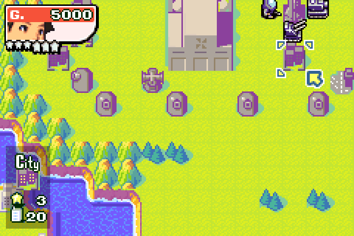</td>
<td>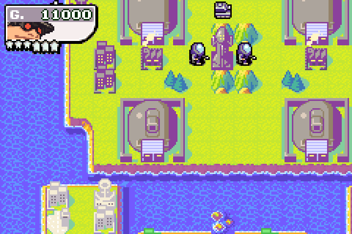</td>
</tr>
<tr>
<td align="center">The Citadel</td>
<td align="center">Hot seat: Black Hole's turn</td>
</tr>
<tr>
<td>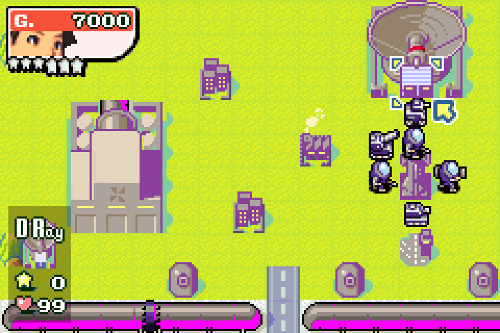</td>
<td>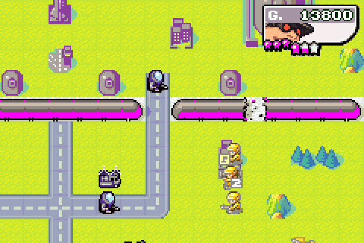</td>
</tr>
<tr>
<td align="center">Black Rampart: the Factory and the Deathray at the top</td>
<td align="center">The pipe wall: one seam blown open</td>
</tr>
<tr>
<td>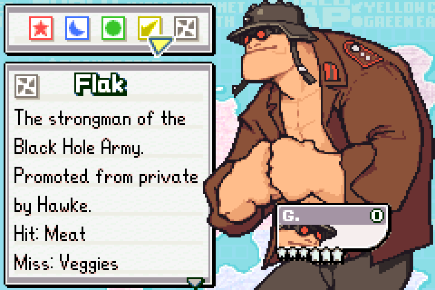</td>
<td>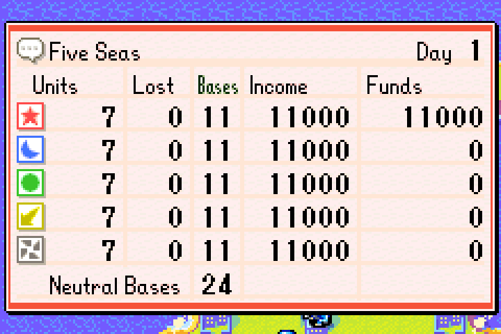</td>
</tr>
<tr>
<td align="center">The CO screen: all five</td>
<td align="center">Intel: all five</td>
</tr>
</table>

**Online.** 5P maps work online like any other map: player 1 moves armies
1, 3 and 5, player 2 armies 2 and 4, and the rest can be the computer.

## Design Room: Black Hole and its inventions

**Design Room → Map** gets Black Hole's army and its inventions. You make
maps under **Play offline**; they play offline and
[online](#online). Keyboard
keys are in brackets (change them in Settings).

| Button | Key |
| --- | --- |
| A / B | Z / X |
| L / R | A / S |
| START / SELECT | Enter / Space |

<table>
<tr>
<td></td>
<td></td>
<td></td>
</tr>
<tr>
<td align="center">Yellow Comet</td>
<td align="center">SELECT or UP: Black Hole</td>
<td align="center">Back to Yellow Comet (DOWN, or SELECT round again)</td>
</tr>
</table>

### Black Hole buildings and units

1. Press **R** (S) to open the terrain bar, or **L** (A) for the unit bar.
2. Highlight a building (HQ, City, Base, Airport, Port) or a unit.
3. Press **SELECT** (Space) or **UP** to change army: Orange Star, Blue
   Moon, Green Earth, Yellow Comet, **Black Hole**, Neutral, and round
   again. You get Black Hole's real HQ, buildings and units.
4. Press **A** (Z) to pick it, then **A** on the map to place it.

To switch between the terrain and unit bars, press **L** or **R**.

<table>
<tr>
<td>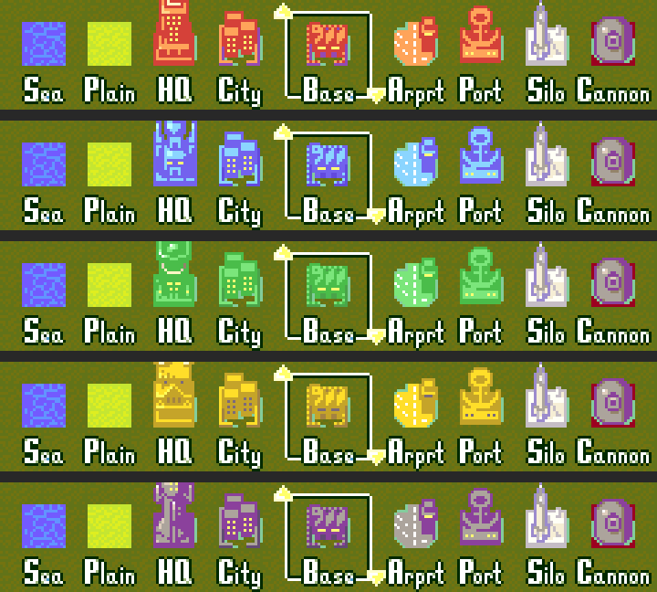</td>
<td>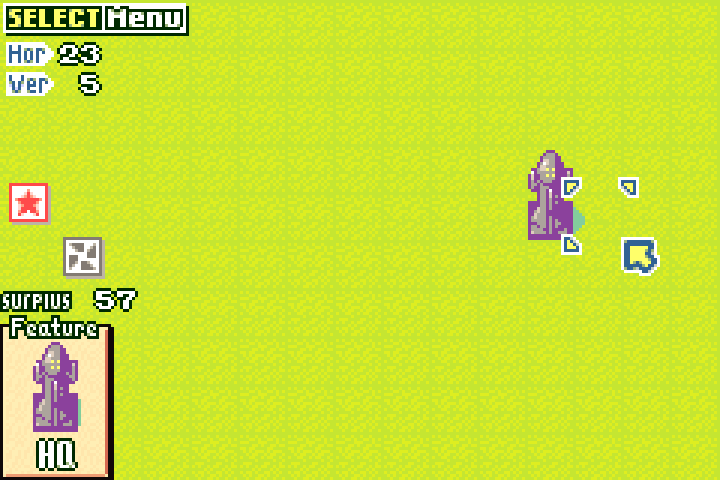</td>
</tr>
<tr>
<td align="center">SELECT: each army with its own HQ, Black Hole last</td>
<td align="center">Black Hole's HQ on the map</td>
</tr>
</table>

**Getting Yellow Comet back.** Keep pressing **SELECT**: it cycles
through every army and comes back round to Yellow Comet, then Black Hole.
**DOWN** goes the other way (Black Hole, then Yellow Comet).

Black Hole and Yellow Comet share one army slot, so a map has one or the
other, like the campaign. Switching changes every piece of that army
already on the map.

<table>
<tr>
<td></td>
<td></td>
</tr>
<tr>
<td align="center">Black Hole units, next to a placed Black Hole base</td>
<td align="center">Back to Yellow Comet: its units, and the placed pieces turn Yellow Comet</td>
</tr>
<tr>
<td>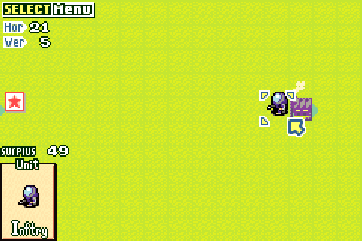</td>
<td>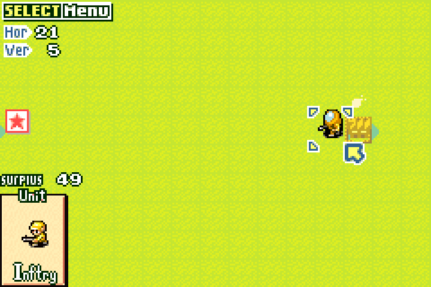</td>
</tr>
<tr>
<td align="center">Placed Black Hole pieces</td>
<td align="center">Switch to Yellow Comet: the same pieces are redrawn as Yellow Comet's</td>
</tr>
</table>

### Inventions

Black Hole's inventions have their own entries in the terrain bar, right
after **Silo**, each with its icon and name, like any other terrain:
minicannons (facing down, up, left and right; the game calls them
"Cannon"), Laser, Black Cannons (facing down and up, also "Cannon"),
Factory, Volcano, D.Ray (the Deathray), and, once you have imported the
Dual Strike art, **Crystal** and **Obelisk** (see [Black Crystal and Black Obelisk](#black-crystal-and-black-obelisk)).

1. Open the terrain bar (**R**) and move to the invention with
   **LEFT/RIGHT**.
2. Press **A** (Z) to pick it, then **A** on the map to place it. Big ones
   are placed around the cursor.

Placed inventions show in the editor exactly as they look in battle. An
invention can't go off the edge of the map or on top of a building or unit.
A map can hold up to 15 inventions, and either a Black Factory or a
Volcano, not both. To remove one, place any terrain on the tile the cursor
was on when you placed it.

<table>
<tr>
<td>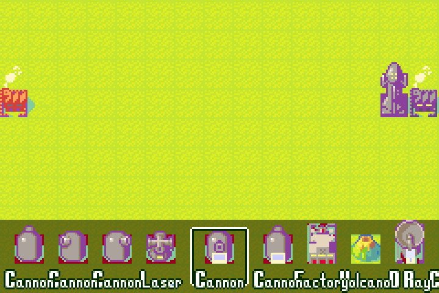</td>
<td>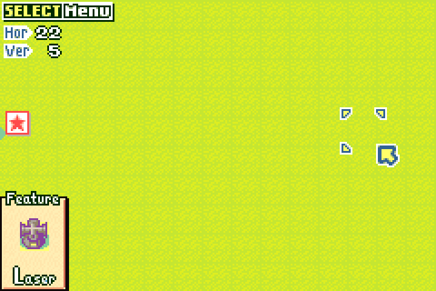</td>
</tr>
<tr>
<td align="center">The inventions in the terrain bar</td>
<td align="center">Laser highlighted</td>
</tr>
</table>

Each invention appears on the map the moment you place it, drawn as it
looks in battle:

<table>
<tr>
<td>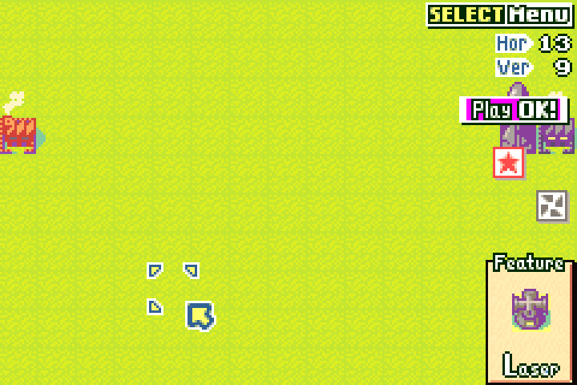</td>
<td>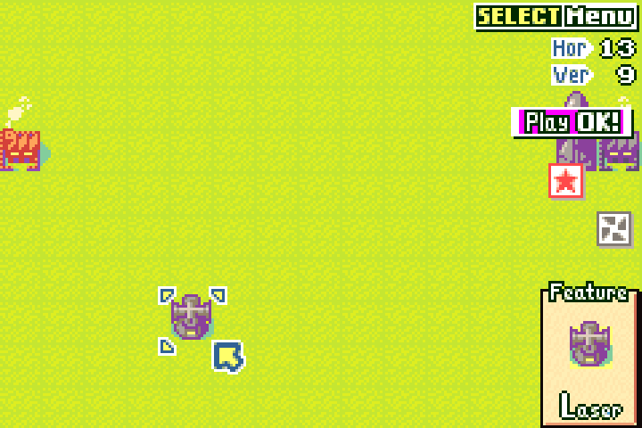</td>
</tr>
<tr>
<td align="center">Laser picked</td>
<td align="center">A on the map: the Laser is there</td>
</tr>
<tr>
<td>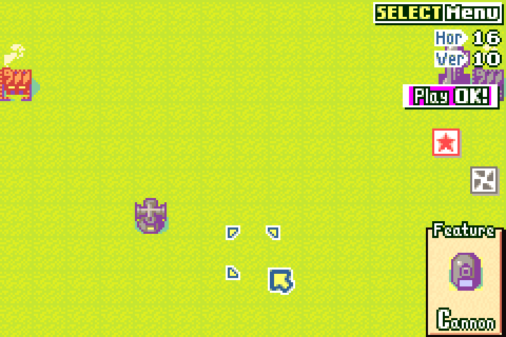</td>
<td>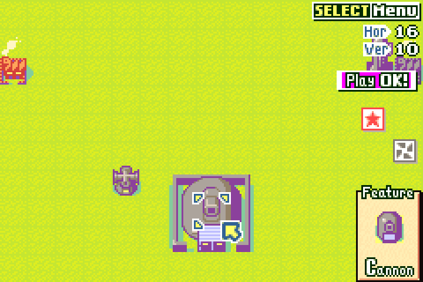</td>
</tr>
<tr>
<td align="center">Black Cannon picked</td>
<td align="center">A on the map: the Black Cannon is there</td>
</tr>
<tr>
<td>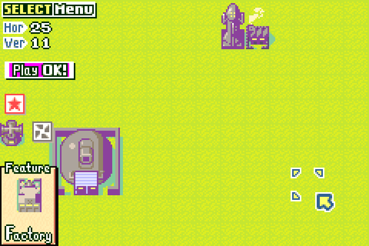</td>
<td>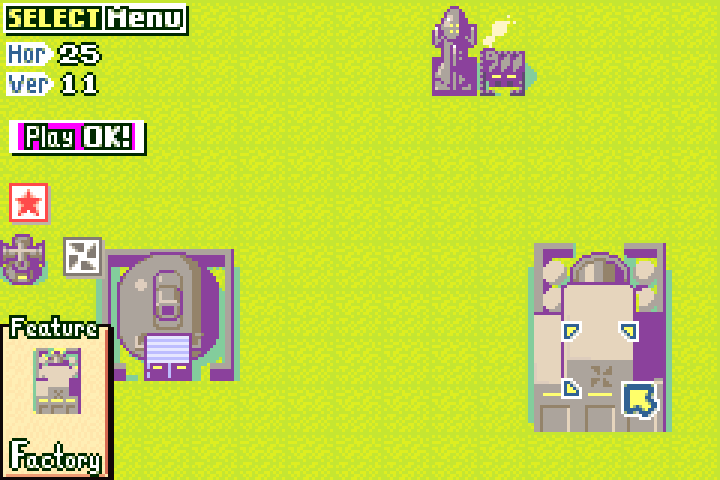</td>
</tr>
<tr>
<td align="center">Black Factory picked</td>
<td align="center">A on the map: the Black Factory is there</td>
</tr>
<tr>
<td>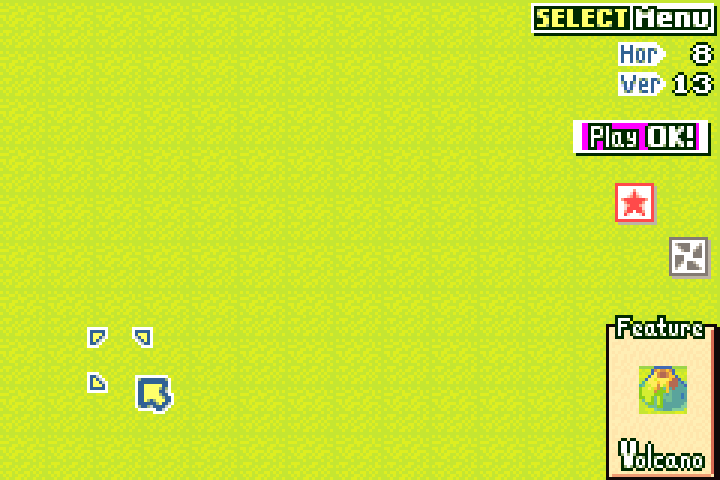</td>
<td>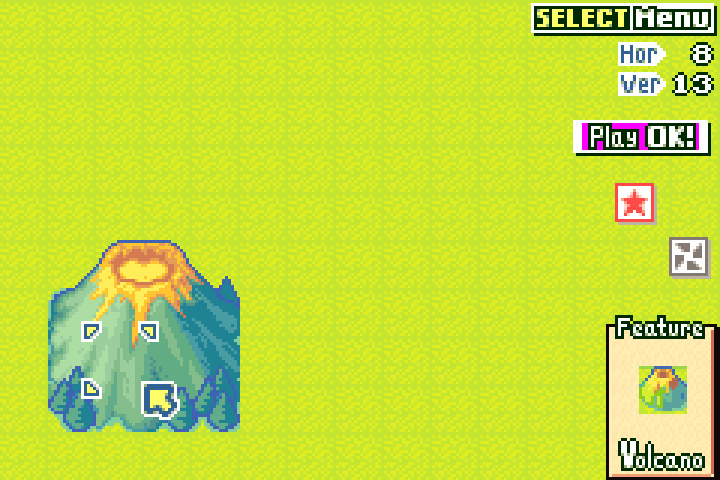</td>
</tr>
<tr>
<td align="center">Volcano picked</td>
<td align="center">A on the map: the Volcano is there</td>
</tr>
<tr>
<td>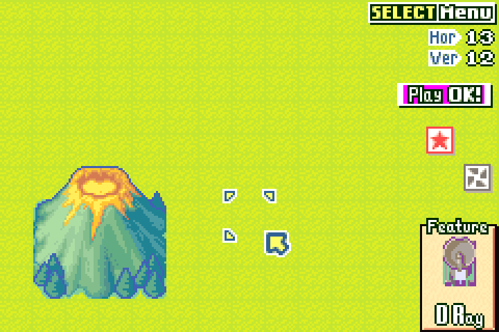</td>
<td>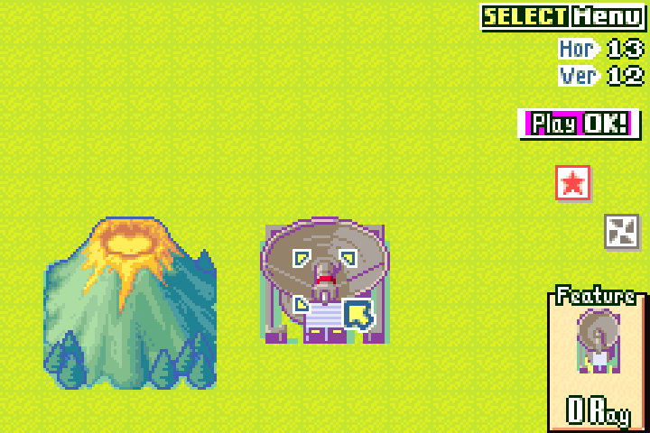</td>
</tr>
<tr>
<td align="center">Deathray picked</td>
<td align="center">A on the map: the Deathray is there</td>
</tr>
</table>

<table>
<tr>
<td></td>
<td>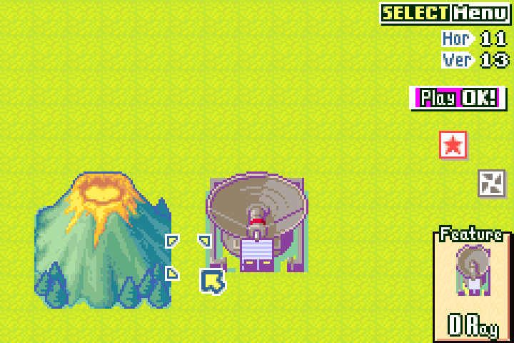</td>
</tr>
<tr>
<td align="center">A map with every kind of cannon and the Deathray</td>
<td align="center">The Volcano and the Deathray</td>
</tr>
</table>

### Saving and playing the map

Save with **SELECT → File → Save** (on the map, with no bar open), then
play it from **Versus → New → Design Maps**. The army you made Black Hole
starts as Black Hole on the Teams screen. Set it to **1P** (the row under
the portraits) to command it yourself, or leave it on **CP**.

Give it a Black Hole CO (Flak, Lash, Adder, Hawke or Sturm: press UP or
DOWN on its portrait) to get Black Hole's HQ and units in battle. With
any other CO, the army keeps Black Hole's colours but uses that CO's
army's HQ and units, as in the original game.

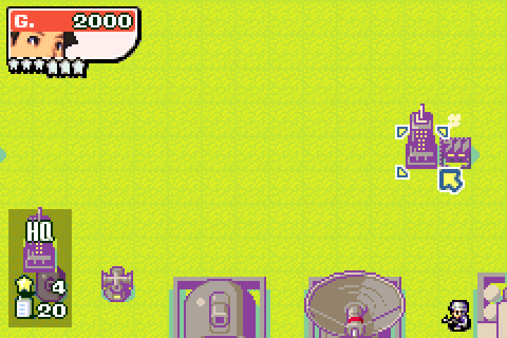

Design maps live in your save. An online match runs on player 1's save,
and tangoAW2 picks player 1 when the match starts, so your design maps
are there online only when you are player 1.

## Black Hole's inventions in battle

Inventions act at the start of Black Hole's turn, for a human player or
the computer, offline and online. Units can't be destroyed by an
invention; it leaves them at 1 HP at worst.

- **Black Factory.** Deploys up to three free ground units on the row
  under it, on the campaign's Factory Blues schedule (Tanks, Mechs,
  Recons, Artillery, Neotanks and more, some days nothing). A door tile
  that's occupied is skipped. The new units can move straight away.
- **Deathray.** Fires every seventh Black Hole turn, straight down: a
  strip three tiles wide from just below it to the edge of the map. It
  hits enemy units only.
- **Laser.** Fires every turn along its whole row and column and hits
  every unit there, Black Hole's own included. Keep your units off its
  lines.
- **Minicannons** fire at an enemy in front of them every turn. **Black
  Cannons** fire every other turn at an enemy in range. The **Volcano**
  rains fire on the map.

<table>
<tr>
<td></td>
<td></td>
</tr>
<tr>
<td align="center">The factory's units, yours to command</td>
<td align="center">Moving a factory-built Recon</td>
</tr>
<tr>
<td></td>
<td></td>
</tr>
<tr>
<td align="center">Before: an Orange Star infantry (5 HP) and a Black Hole Recon (10 HP) below the Deathray</td>
<td align="center">The Deathray fires</td>
</tr>
<tr>
<td></td>
<td></td>
</tr>
<tr>
<td align="center">After: the enemy is down to 1 HP, the Recon is untouched</td>
<td align="center">The laser fires along its row and column</td>
</tr>
</table>

### Online

Design maps work in online matches, inventions included: both players run
the same game, so the factory, the Deathray and the rest act identically
on both screens. Player 1 has to be the one with the design map in their
save (see [Saving and playing the map](#saving-and-playing-the-map)).

Tested over a simulated laggy connection (7 to 10 frames of jittery
delay), Orange Star against a human Black Hole for seven days on a design
map with every kind of invention. The factory deployed its units, the
Black Hole player moved them, and on day 7 the Deathray took an Orange
Star infantry to 1 HP while a Black Hole Recon in the same beam kept all
10. Both players' games stayed identical down to the last byte through
1,789 rollbacks.

Also played as a full live match through tangoAW2's real online code (two
players connected directly, on one computer): Yellow Comet (Sonja) against
Black Hole (Flak), seven days on the same design map, each army in its own
designs. The factory, the Black Hole player's moves and the day-7 Deathray
played out the same on both screens from the first frame to the last.

<table>
<tr>
<td>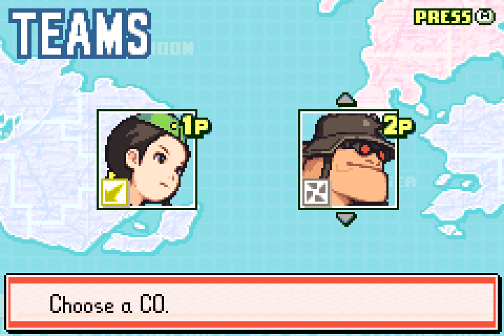</td>
<td>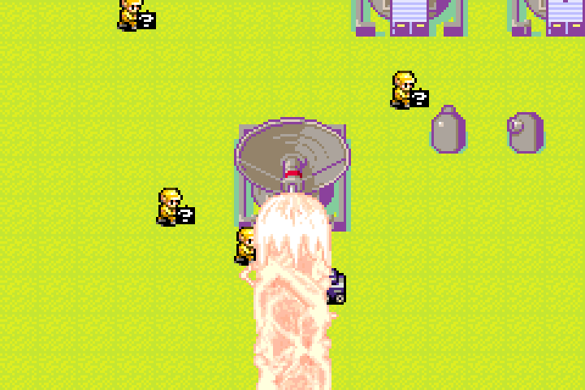</td>
</tr>
<tr>
<td align="center">Yellow Comet (Sonja) against Black Hole (Flak)</td>
<td align="center">Day 7, live: the Deathray fires</td>
</tr>
</table>

<table>
<tr>
<td></td>
<td></td>
</tr>
<tr>
<td align="center">Black Hole's player moves a factory Recon</td>
<td align="center">Orange Star's player sees it arrive</td>
</tr>
<tr>
<td></td>
<td></td>
</tr>
<tr>
<td align="center">Day 7, Black Hole's screen: the Deathray fires</td>
<td align="center">The same moment on Orange Star's screen</td>
</tr>
<tr>
<td></td>
<td></td>
</tr>
<tr>
<td align="center">After: the enemy at 1 HP, the Recon untouched</td>
<td></td>
</tr>
</table>

## Black Crystal and Black Obelisk

> **Hidden feature.** These only appear if you choose to load your own
> Advance Wars: Dual Strike `.nds` file (once; see
> [below](#getting-them-import-your-dual-strike-rom-once)). Without it,
> tangoAW2 works exactly as before and none of this shows.

Two Black Hole structures from Advance Wars: Dual Strike, added by
tangoAW2 and drawn with Dual Strike's own sprites:

| | Size | At the start of Black Hole's turn |
| --- | --- | --- |
| **Black Crystal** | 1 tile | Black Hole units within 2 spaces get **+2 HP** (20 %) and full fuel and ammo. |
| **Black Obelisk** | 3 x 3 | Black Hole units within 4 spaces of it get **+4 HP** (40 %) and full fuel and ammo. |

They heal Black Hole only: enemies and allies standing next to them get
nothing. They never fire, and they can be attacked and destroyed like a
minicannon (the Crystal) or a Black Cannon (the Obelisk); a destroyed one
stops healing. Move the cursor onto one and the terrain panel shows its
name and, on the Obelisk's bottom-middle tile, its HP (as for a Black
Cannon). Real minicannons and Black Cannons are unchanged and still fire.

### Getting them: import your Dual Strike ROM once

tangoAW2 doesn't include Dual Strike's art; it takes the two sprites from
your own copy of **Advance Wars: Dual Strike** (USA, the `.nds` file).

1. Put your Dual Strike `.nds` in the same `roms` folder as your Advance
   Wars 2 file (see [First run](#first-run)).
2. Start tangoAW2 again. It saves the two sprites there as
   **Dual Strike Black Obelisk art.tangoaw2**.
3. That's it: you can move or delete the `.nds` now. Keep the
   `.tangoaw2` file; it is all tangoAW2 needs from then on.

**Without it** the Black Crystal and Black Obelisk are hidden: the four
maps below are not in the map lists, the 5P tab has five maps, and the
Design Room's terrain bar goes straight from D.Ray to Pipe. Everything
else in tangoAW2 works the same.

<table>
<tr>
<td>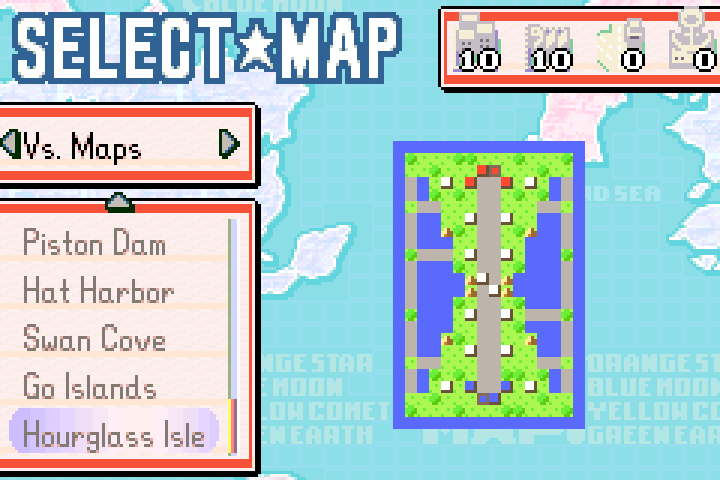</td>
<td>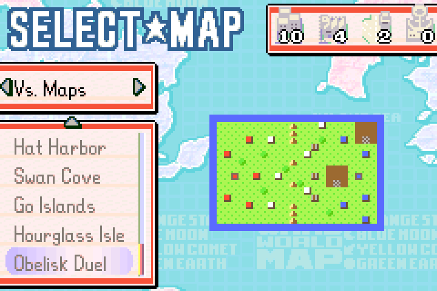</td>
</tr>
<tr>
<td align="center">Without the Dual Strike art</td>
<td align="center">With it: Obelisk Duel</td>
</tr>
<tr>
<td>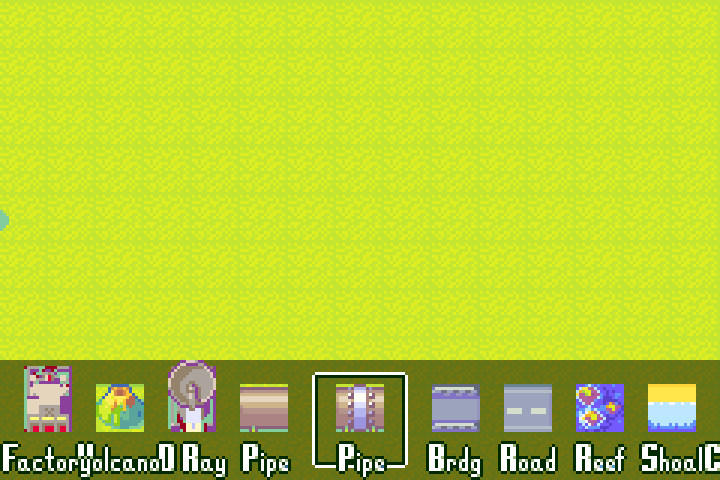</td>
<td>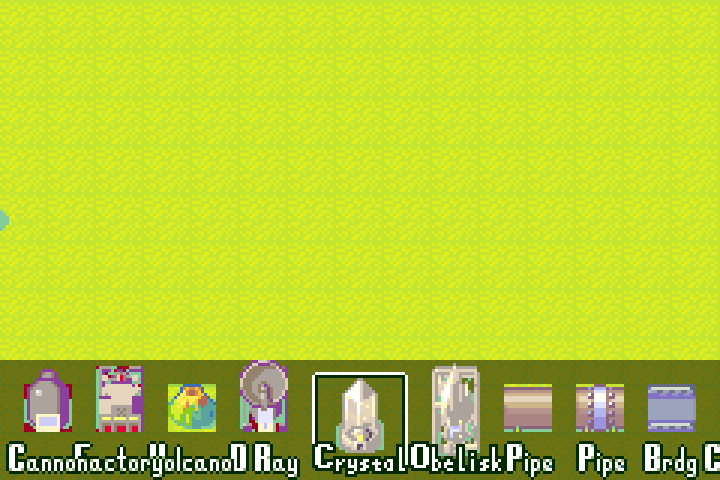</td>
</tr>
<tr>
<td align="center">Design Room without it</td>
<td align="center">With it: Crystal and Obelisk</td>
</tr>
</table>

**Online**, the maps show only when **both** players have imported the
art; if either hasn't, they are hidden for both (so your map lists always
match). You can still play each other either way.

### Maps

Four maps use them:

| Map | Tab | Armies |
| --- | --- | --- |
| **Obelisk Duel** | 2P (Vs.) | Orange Star against Black Hole, whose HQ sits behind an Obelisk, with two Crystals mid-field, a minicannon and a Black Cannon. |
| **Crystal Isles** | 3P | Orange Star and Blue Moon on northern islands, Black Hole on the southern one with an Obelisk and two Crystals. Landers and Cruisers cross the sea. |
| **Obelisk Plains** | 4P | Four corners on open plains. Black Hole's corner has an Obelisk and minicannons; four Crystals in the middle heal whichever Black Hole units reach them. |
| **Black Monolith** | 5P | All five armies. Black Hole holds the centre: an Obelisk, four Crystals and a minicannon on each side. |

<table>
<tr>
<td>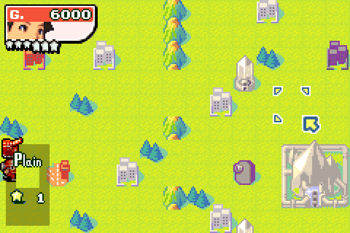</td>
<td>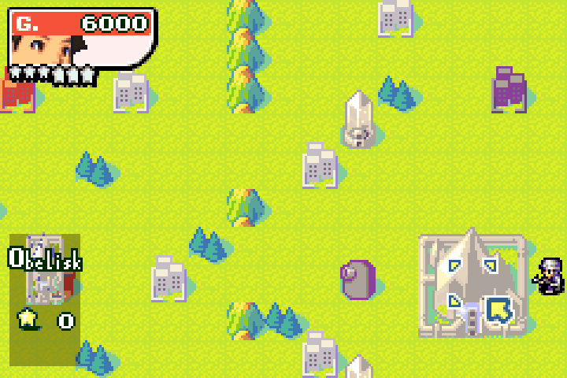</td>
</tr>
<tr>
<td align="center">Obelisk Duel</td>
<td align="center">The terrain panel names it</td>
</tr>
<tr>
<td>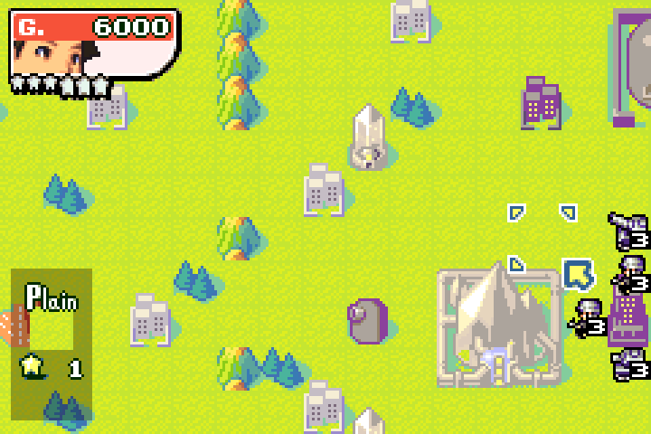</td>
<td>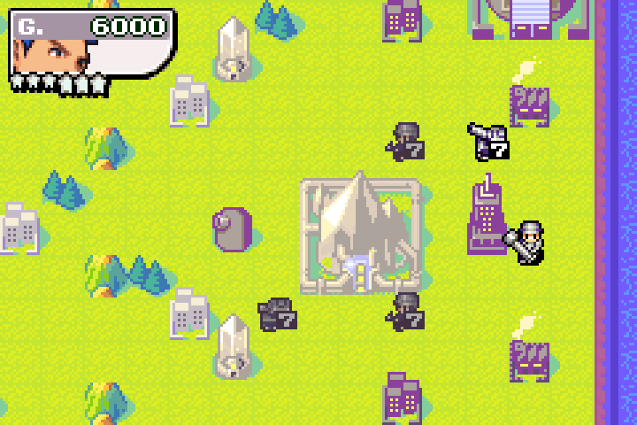</td>
</tr>
<tr>
<td align="center">Black Hole's units at 3 HP...</td>
<td align="center">...at 7 HP on Black Hole's next turn</td>
</tr>
<tr>
<td>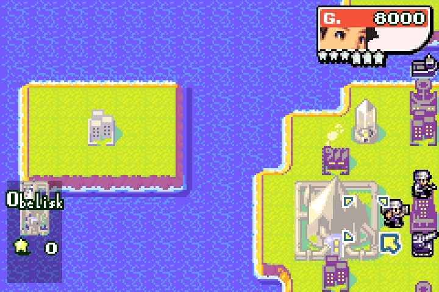</td>
<td>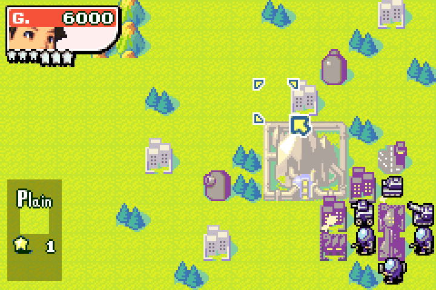</td>
</tr>
<tr>
<td align="center">Crystal Isles (3P)</td>
<td align="center">Obelisk Plains (4P)</td>
</tr>
<tr>
<td>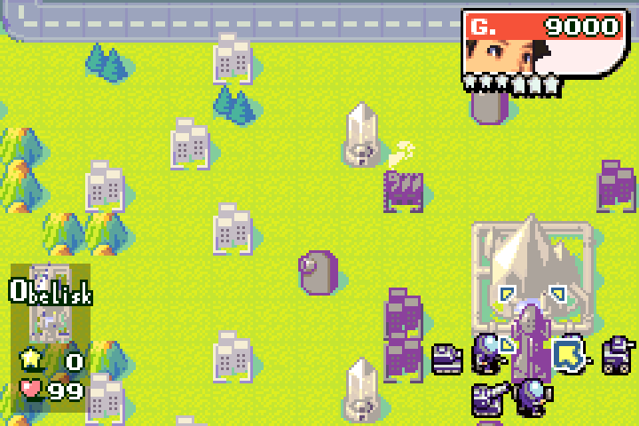</td>
<td></td>
</tr>
<tr>
<td align="center">Black Monolith (5P)</td>
<td></td>
</tr>
</table>

### Design Room

With the art imported, **Crystal** and **Obelisk** are in the terrain bar,
after D.Ray. Pick one with **A** (Z) and press **A** on the map to place it; the
Obelisk goes around the cursor. They count towards the map's 15
inventions and save and play like any other invention. They heal the
Black Hole army, so switch slot 4 to Black Hole (**UP** past Yellow
Comet) for them to do anything.

<table>
<tr>
<td></td>
<td>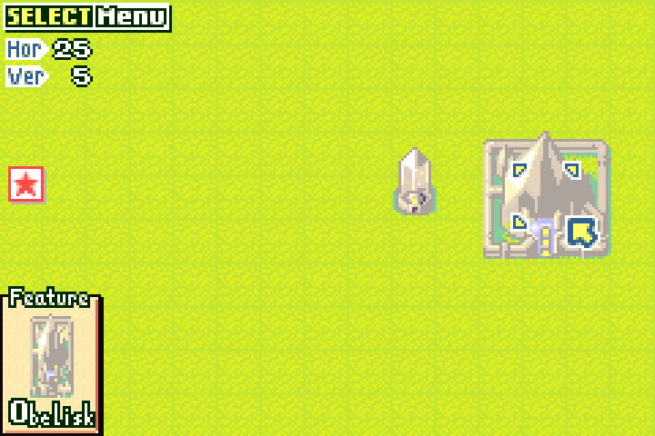</td>
</tr>
<tr>
<td align="center">In the terrain bar</td>
<td align="center">Placed on the map</td>
</tr>
<tr>
<td>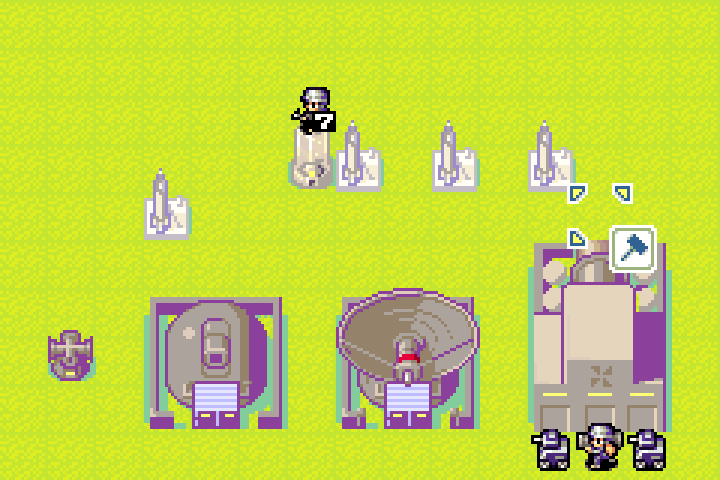</td>
<td></td>
</tr>
<tr>
<td align="center">That design map in battle: the Crystal has healed the infantry to 7 HP</td>
<td></td>
</tr>
</table>

## Playing with a friend

Your friend installs tangoAW2 the same way, with their own copy of the
same cartridge. Both of you need the same tangoAW2 version.

**Link code (easiest).** Both of you type the same made-up code, such as
`sturm-4812`, into the link-code box on the Play tab. The matchmaking
server introduces the two apps and then gets out of the way. It works
through most home routers without any setup.

**Direct connection (no server).** One player types `/host` and the
other types `/connect <host's IP address>`. The host must be reachable on
UDP port 24680. That works on the same network, over a VPN such as
Tailscale, or with that port forwarded on the host's router.

Then:

1. Both press Ready. The game starts from power-on for both of you.
2. Go to **Versus → New** and pick a map (2P, 3P, 4P or the 5P tab).
3. On the **Teams** screen, set army 2 to **2P** (move right to the "CP"
   marker and press up). Highlight an army and press **SELECT** to change
   its colour, Black Hole included; either player can press it. On 3- and
   4-army maps, set alliances next if you want a team game.
4. Pick COs and rules. With fog of war on, the screen goes dark for the
   waiting player during the other army's turn, so nobody sees through
   the other side's fog.
5. Play. Player 1 moves army 1 (and armies 3 and 5 on bigger maps);
   player 2 moves army 2 (and army 4).

The Black Crystal and Black Obelisk maps show online only when both of you
have loaded the Dual Strike art; otherwise they are hidden for both of you
and everything else plays as usual.

## Running two copies on one computer

For testing, start two copies with separate profiles, then `/host` in
one and `/connect 127.0.0.1` in the other:

```sh
TANGOAW2_PROFILE=~/tangoaw2-p1 ./tango
TANGOAW2_PROFILE=~/tangoaw2-p2 ./tango
```

Each profile keeps its own config, saves and `roms` folder.
`TANGOAW2_AUTOSTART=offline` presses Play offline as soon as the library
is scanned, which is handy for scripted checks.

## Building from source

Install Rust stable, CMake, Ninja and `protoc`, then:

```sh
cargo run --release --bin tango
```

The tools behind the Advance Wars 2 work are included:

```sh
# Drive the game headlessly from a script: screenshots, RAM dumps, pokes.
cargo run --release -p tango-backend-mgba --example gba_probe -- rom.gba script.txt

# The same script language on the console with tangoAW2's patches (what
# Play offline runs), used to build and check the Design Room support.
cargo run --release -p tango-gamesupport-aw2 --example aw2_script -- rom.gba script.txt

# Two rollback peers with a delayed, jittery fake network; checks both
# end on the same frame as a replay of the confirmed inputs.
cargo run --release -p tango-gamesupport-aw2 --example aw2_rollback_sim -- rom.gba out/
```

The full set of checks (offline, every army colour on 2-, 3- and 4-army
maps, rollback, and two peers over the real network stack) is listed in
[CONTRIBUTING.md](CONTRIBUTING.md).

How the Advance Wars 2 support works, and the RAM addresses it relies
on, is in [docs/AW2.md](docs/AW2.md). The engine's layout and checks are in
[ARCHITECTURE.md](ARCHITECTURE.md) and [CONTRIBUTING.md](CONTRIBUTING.md).

## License

GPL-3.0-or-later, like Tango. See [LICENSE](LICENSE) and
[CREDITS.md](CREDITS.md). Advance Wars is a trademark of Nintendo.
tangoAW2 is not affiliated with Nintendo or Intelligent Systems.
