# tangoAW2

Rollback netplay for **Advance Wars 2: Black Hole Rising** (GBA, USA), with
everything unlocked, Black Hole as a fifth playable army, and Black Hole's
inventions in the Design Room.

tangoAW2 is a fork of [Tango](https://github.com/tangobattle/tango) by the
Tango developers. It keeps Tango's emulator (mGBA), rollback engine, lobby
and networking, and adds Advance Wars 2 on top.

No game is included. You need your own copy of the cartridge dumped to a
`.gba` file.

## What it does

- **Rollback netplay.** Both players run the same emulated Game Boy
  Advance in the game's own Versus mode. Your button presses show up
  instantly. If your friend's input arrives late, the game quietly
  rewinds a few frames and replays them with the right input.
- **Turns are enforced.** On the battlefield only the player whose army
  is moving can press anything. In menus (map select, CO select, rules,
  the "Next turn" screen) both players can press. With fog of war on,
  the waiting player's screen goes dark during the other army's turn.
- **Everything unlocked.** Every CO including Sturm, every CO colour
  edit, every Battle Map, Hard Campaign and the Sound Room. This is
  applied while the game runs, like Slippi's codes for Melee, so the ROM
  file is never modified. Save in-game and it sticks.
- **Five armies, picked in the game.** On Versus' **Teams** screen, move
  to an army and press **SELECT** (or **R**) to change its colour, **L**
  to go back: Orange Star, Blue Moon, Yellow Comet, Green Earth and
  **Black Hole**, each with its own emblem. It works on 2-, 3- and 4-army
  maps, team (alliance) games included, online and offline. Units,
  buildings, HQs and banners take the picked army's colours; Campaign and
  War Room keep their story armies.
- **Black Hole in the Design Room.** Build maps with a Black Hole army and
  Black Hole's inventions: minicannons, laser, Black Cannons, Black
  Factory, Volcano and Deathray, and switch back to Yellow Comet any
  time. See [Design Room](#design-room-black-hole-and-its-inventions).
- **Play as Black Hole with its inventions.** The Black Factory deploys
  units for you and the Deathray fires on your enemies, like in the
  campaign, offline and online. See [inventions in battle](#black-holes-inventions-in-battle).
- **Play offline** without a connection, or online with a friend through a
  link code or a direct connection.

<table>
<tr>
<td>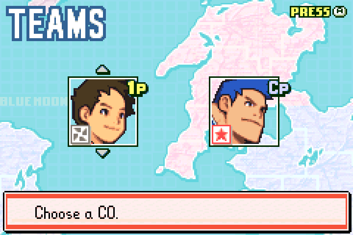</td>
<td>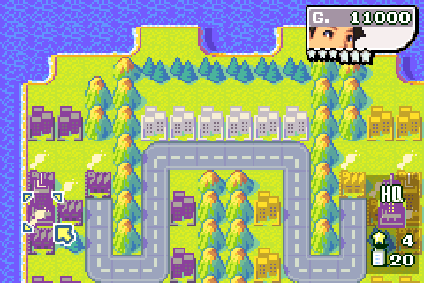</td>
</tr>
<tr>
<td align="center">Black Hole on the Teams screen (SELECT)</td>
<td align="center">Black Hole in battle</td>
</tr>
<tr>
<td>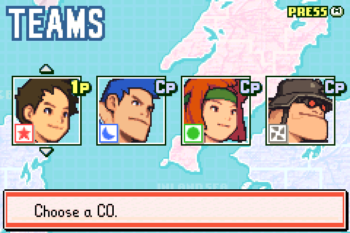</td>
<td>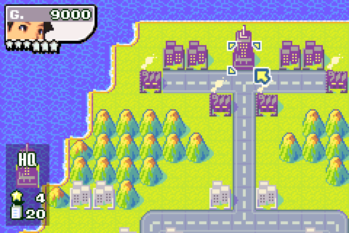</td>
</tr>
<tr>
<td align="center">Four armies</td>
<td align="center">Three armies</td>
</tr>
</table>

## Get it

Download the latest build for your system from
[Releases](https://github.com/rkoh46/tangoAW2/releases):

| System | File |
| --- | --- |
| Windows 10/11 | `tangoaw2-x86_64-windows.exe` (installer) |
| macOS (Apple Silicon and Intel) | `tangoaw2-macos.dmg` |
| Linux | `tangoaw2-x86_64-linux.AppImage` |

On macOS the app is not signed. The first time, right-click it and choose
Open.

## First run

1. Open tangoAW2 and pick a nickname.
2. Put your Advance Wars 2 file in the `roms` folder the welcome screen
   shows. It must be the USA cartridge (No-Intro
   `Advance Wars 2 - Black Hole Rising (USA)`, CRC32 `5AD0E571`).
3. That's it. tangoAW2 selects the game and creates a blank save for you
   the first time. Everything is unlocked anyway.

## Playing alone

Press **Play offline** on the Play tab. The game starts straight away, with
everything unlocked, and needs no internet connection. Campaign, War Room,
Versus against the computer and the Design Room all work.

In Versus, change any army's colour on the Teams screen with **SELECT**
(or **R**, and **L** to go back). Each army starts in the map's own colour.

## Design Room: Black Hole and its inventions

**Design Room → Map** gets Black Hole's army and its inventions. You make
maps under **Play offline**; they play offline and
[online](#online). Keyboard
keys are in brackets (change them in Settings).

| Button | Key |
| --- | --- |
| A / B | Z / X |
| L / R | A / S |
| START / SELECT | Enter / Space |

<table>
<tr>
<td>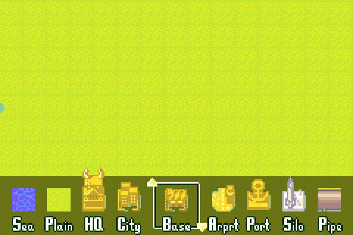</td>
<td>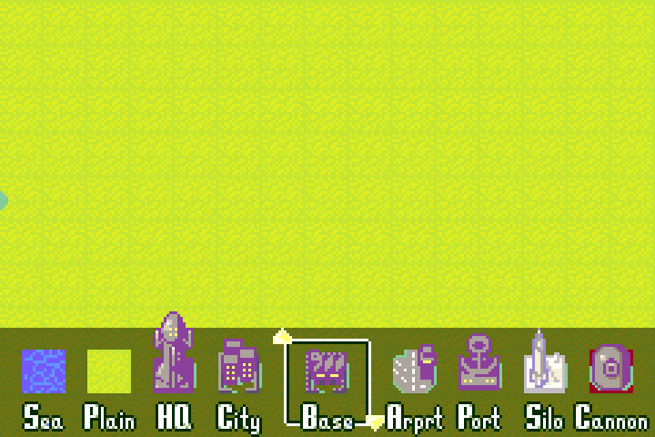</td>
<td>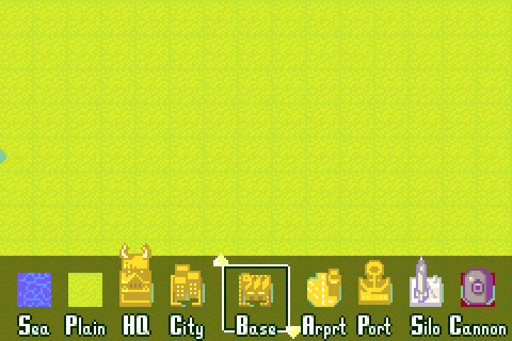</td>
</tr>
<tr>
<td align="center">Yellow Comet</td>
<td align="center">UP: Black Hole</td>
<td align="center">DOWN: Yellow Comet again</td>
</tr>
</table>

### Black Hole buildings and units

1. Press **R** (S) to open the terrain bar, or **L** (A) for the unit bar.
2. Highlight a building (HQ, City, Base, Airport, Port) or a unit.
3. Press **UP** to walk through the armies: Orange Star, Blue Moon, Green
   Earth, Yellow Comet. Press **UP** once more on Yellow Comet to get
   **Black Hole**: its HQ, buildings and units, with its emblem.
4. Press **A** (Z) to pick it, then **A** on the map to place it.

**Getting Yellow Comet back.** Black Hole and Yellow Comet share one army
slot, so a design map has one or the other, like the campaign. While
Black Hole is showing, press **DOWN** once to go back to Yellow Comet;
DOWN again gives Green Earth. The choice is for the whole map: switching
back turns every Black Hole piece you've placed into Yellow Comet, and
switching to Black Hole turns Yellow Comet's pieces black.

<table>
<tr>
<td>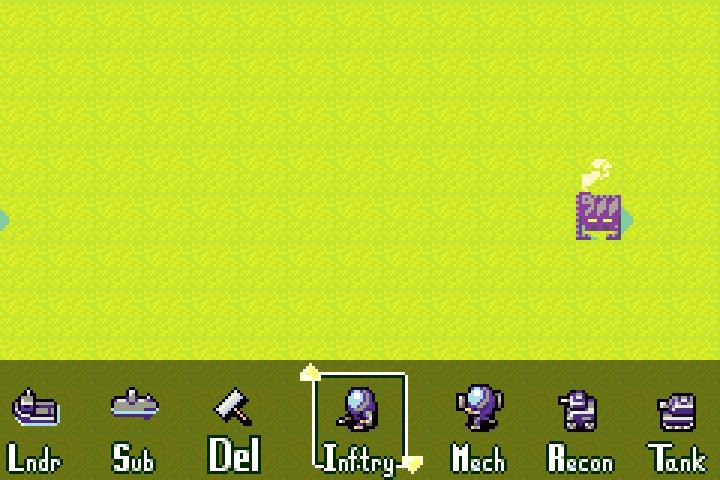</td>
<td>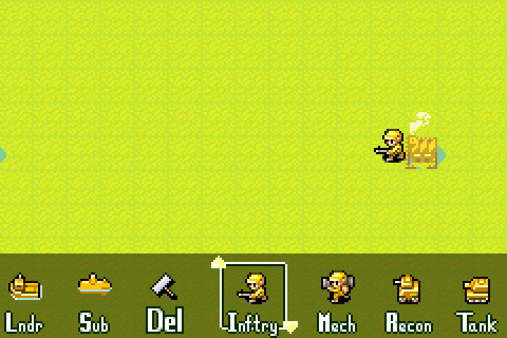</td>
</tr>
<tr>
<td align="center">Black Hole units</td>
<td align="center">DOWN: Yellow Comet, placed pieces follow</td>
</tr>
</table>

### Inventions

1. Open the terrain bar (**R**) and highlight **Silo**.
2. Press **UP/DOWN** to pick an invention. Its name shows in the top-right
   corner: minicannon (facing down, up, left or right), laser, Black
   Cannon (facing down or up), Black Factory, Volcano, Deathray.
3. Press **A** to choose it, then **A** on the map to place it. Big ones
   are placed around the cursor.

The editor has no pictures for inventions, so tangoAW2 outlines and
labels them on the map. A placement is refused if it would leave the map
or cover a building or unit. A map holds up to 15 inventions, and the
Black Factory or the Volcano but not both (the game draws them from the
same graphics memory). To remove one, place any terrain on its labelled
tile; the rest of it clears itself.

<table>
<tr>
<td>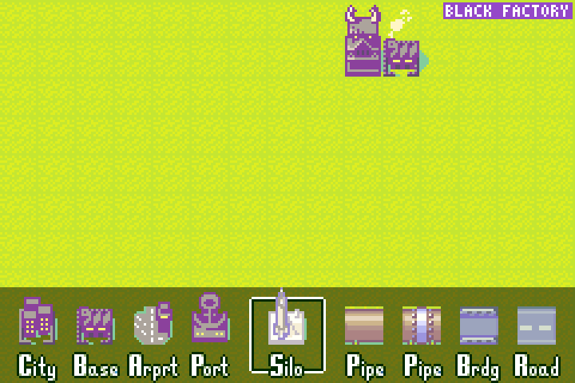</td>
<td>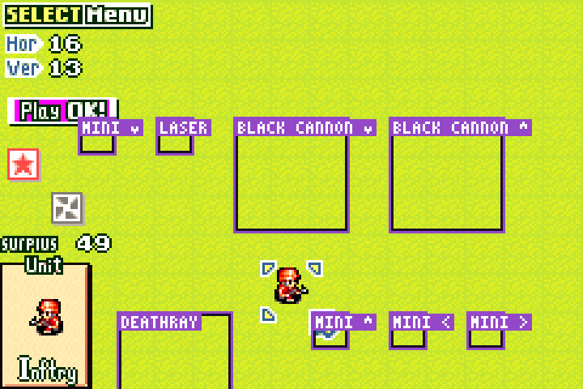</td>
</tr>
<tr>
<td align="center">Silo + UP/DOWN picks an invention</td>
<td align="center">Placed inventions, labelled</td>
</tr>
</table>

### Saving and playing the map

Save with **SELECT → File → Save**, then play it from **Versus → New →
Design Maps**. The army you made Black Hole starts as Black Hole on the
Teams screen. Set it to **1P** (the row under the portraits) to command
it yourself, or leave it on **CP**. Design maps live in your save. An
online match runs on player 1's save, and tangoAW2 picks player 1 when
the match starts, so your design maps are there online only when you
are player 1.

## Black Hole's inventions in battle

Inventions act at the start of Black Hole's turn, for a human player or
the computer, offline and online. Units can't be destroyed by an
invention; it leaves them at 1 HP at worst.

- **Black Factory.** Deploys up to three free ground units on the row
  under it, on the campaign's Factory Blues schedule (Tanks, Mechs,
  Recons, Artillery, Neotanks and more, some days nothing). A door tile
  that's occupied is skipped. The new units can move straight away.
- **Deathray.** Fires every seventh Black Hole turn, straight down: a
  strip three tiles wide from just below it to the edge of the map. It
  hits enemy units only.
- **Laser.** Fires every turn along its whole row and column and hits
  every unit there, Black Hole's own included. Keep your units off its
  lines.
- **Minicannons** fire at an enemy in front of them every turn. **Black
  Cannons** fire every other turn at an enemy in range. The **Volcano**
  rains fire on the map.

<table>
<tr>
<td>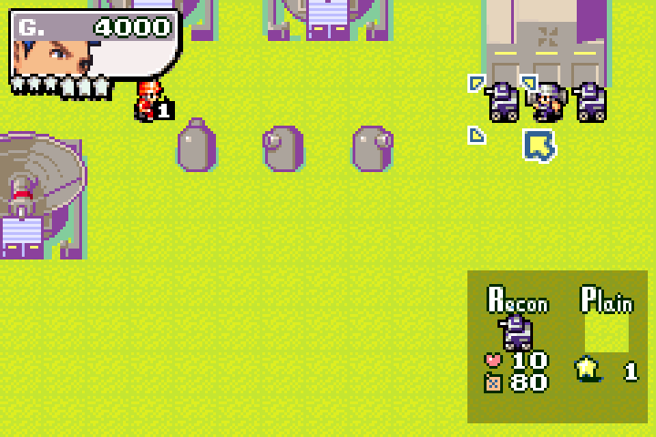</td>
<td>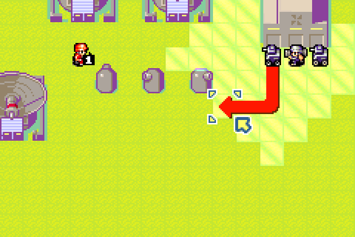</td>
</tr>
<tr>
<td align="center">The factory's units, yours to command</td>
<td align="center">Moving a factory-built Recon</td>
</tr>
<tr>
<td>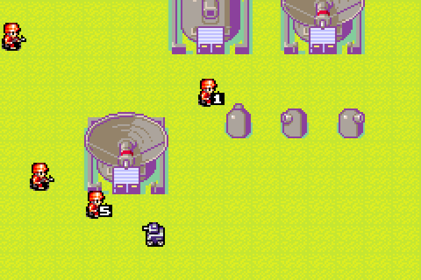</td>
<td>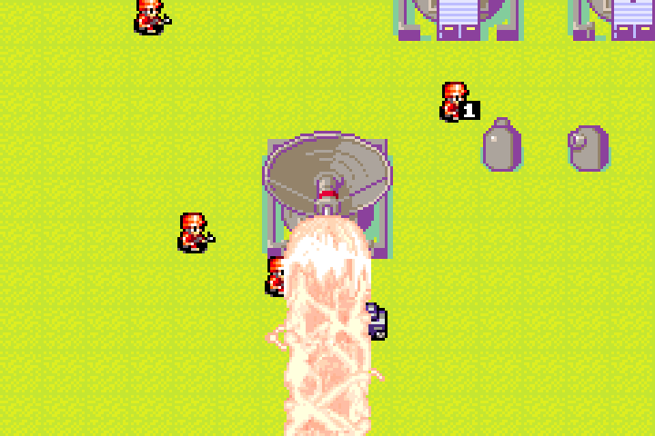</td>
</tr>
<tr>
<td align="center">Before: an Orange Star infantry (5 HP) and a Black Hole Recon (10 HP) below the Deathray</td>
<td align="center">The Deathray fires</td>
</tr>
<tr>
<td>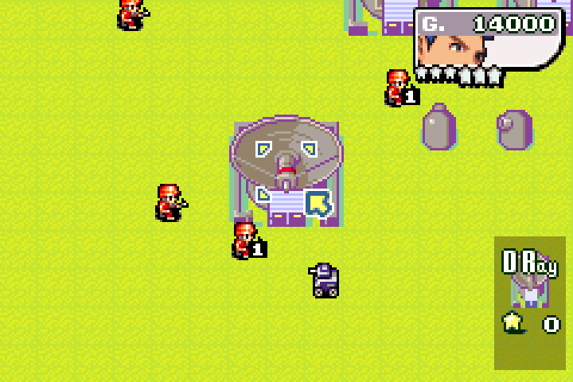</td>
<td>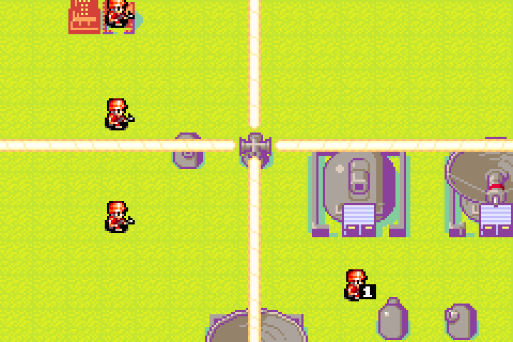</td>
</tr>
<tr>
<td align="center">After: the enemy is down to 1 HP, the Recon is untouched</td>
<td align="center">The laser fires along its row and column</td>
</tr>
</table>

### Online

Design maps work in online matches, inventions included: both players run
the same game, so the factory, the Deathray and the rest act identically
on both screens. Player 1 has to be the one with the design map in their
save (see [Saving and playing the map](#saving-and-playing-the-map)).

Tested over a simulated laggy connection (7 to 10 frames of jittery
delay), Orange Star against a human Black Hole for seven days on a design
map with every kind of invention. The factory deployed its units, the
Black Hole player moved them, and on day 7 the Deathray took an Orange
Star infantry to 1 HP while a Black Hole Recon in the same beam kept all
10. Both players' games stayed identical down to the last byte through
1,789 rollbacks.

<table>
<tr>
<td></td>
<td>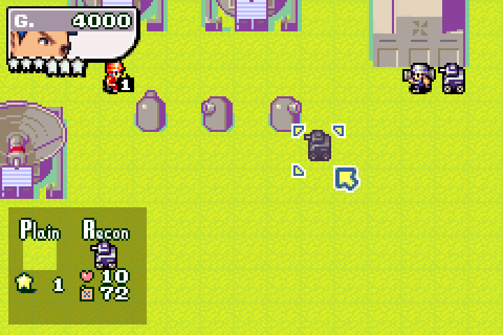</td>
</tr>
<tr>
<td align="center">Black Hole's player moves a factory Recon</td>
<td align="center">Orange Star's player sees it arrive</td>
</tr>
<tr>
<td>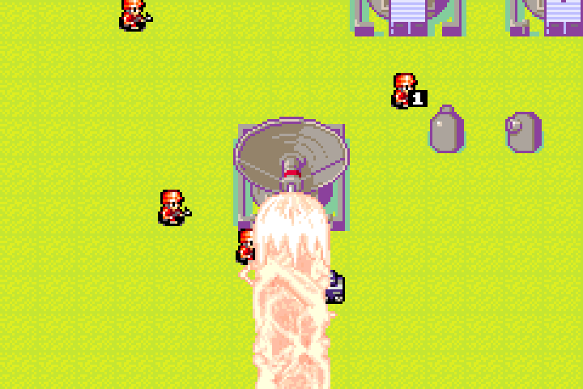</td>
<td></td>
</tr>
<tr>
<td align="center">Day 7, Black Hole's screen: the Deathray fires</td>
<td align="center">The same moment on Orange Star's screen</td>
</tr>
<tr>
<td></td>
<td></td>
</tr>
<tr>
<td align="center">After: the enemy at 1 HP, the Recon untouched</td>
<td></td>
</tr>
</table>

## Playing with a friend

Your friend installs tangoAW2 the same way, with their own copy of the
same cartridge. Both of you need the same tangoAW2 version.

**Link code (easiest).** Both of you type the same made-up code, such as
`sturm-4812`, into the link-code box on the Play tab. The matchmaking
server introduces the two apps and then gets out of the way. It works
through most home routers without any setup.

**Direct connection (no server).** One player types `/host` and the
other types `/connect <host's IP address>`. The host must be reachable on
UDP port 24680. That works on the same network, over a VPN such as
Tailscale, or with that port forwarded on the host's router.

Then:

1. Both press Ready. The game starts from power-on for both of you.
2. Go to **Versus → New** and pick a map (2P, 3P or 4P).
3. On the **Teams** screen, set army 2 to **2P** (move right to the "CP"
   marker and press up). Highlight an army and press **SELECT** to change
   its colour, Black Hole included; either player can press it. On 3- and
   4-army maps, set alliances next if you want a team game.
4. Pick COs and rules. With fog of war on, the screen goes dark for the
   waiting player during the other army's turn, so nobody sees through
   the other side's fog.
5. Play. Player 1 moves army 1 (and army 3 on four-army maps); player 2
   moves army 2 (and army 4).

## Running two copies on one computer

For testing, start two copies with separate profiles, then `/host` in
one and `/connect 127.0.0.1` in the other:

```sh
TANGOAW2_PROFILE=~/tangoaw2-p1 ./tango
TANGOAW2_PROFILE=~/tangoaw2-p2 ./tango
```

Each profile keeps its own config, saves and `roms` folder.
`TANGOAW2_AUTOSTART=offline` presses Play offline as soon as the library
is scanned, which is handy for scripted checks.

## Building from source

Install Rust stable, CMake, Ninja and `protoc`, then:

```sh
cargo run --release --bin tango
```

The tools behind the Advance Wars 2 work are included:

```sh
# Drive the game headlessly from a script: screenshots, RAM dumps, pokes.
cargo run --release -p tango-backend-mgba --example gba_probe -- rom.gba script.txt

# The same script language on the console with tangoAW2's patches (what
# Play offline runs), used to build and check the Design Room support.
cargo run --release -p tango-gamesupport-aw2 --example aw2_script -- rom.gba script.txt

# Two rollback peers with a delayed, jittery fake network; checks both
# end on the same frame as a replay of the confirmed inputs.
cargo run --release -p tango-gamesupport-aw2 --example aw2_rollback_sim -- rom.gba out/
```

The full set of checks (offline, every army colour on 2-, 3- and 4-army
maps, rollback, and two peers over the real network stack) is listed in
[CONTRIBUTING.md](CONTRIBUTING.md).

How the Advance Wars 2 support works, and the RAM addresses it relies
on, is in [docs/AW2.md](docs/AW2.md). The engine's layout and checks are in
[ARCHITECTURE.md](ARCHITECTURE.md) and [CONTRIBUTING.md](CONTRIBUTING.md).

## License

GPL-3.0-or-later, like Tango. See [LICENSE](LICENSE) and
[CREDITS.md](CREDITS.md). Advance Wars is a trademark of Nintendo.
tangoAW2 is not affiliated with Nintendo or Intelligent Systems.
