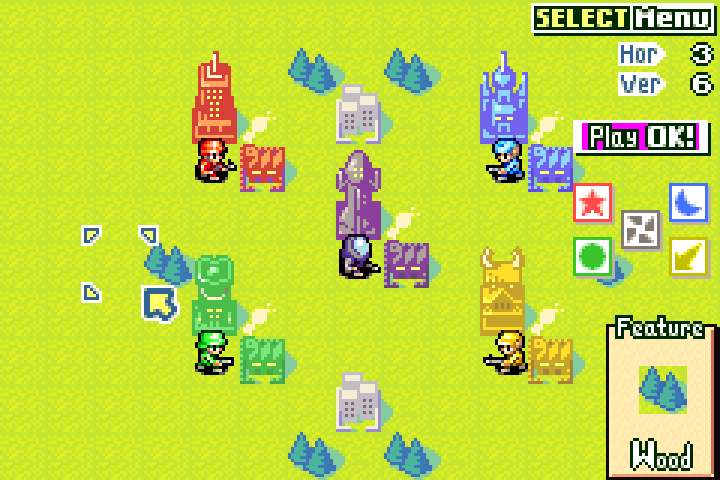

# tangoAW2

Rollback netplay for **Advance Wars 2: Black Hole Rising** (GBA, USA).

tangoAW2 is a fork of [Tango](https://github.com/tangobattle/tango), the
rollback netplay app used for Mega Man Battle Network. It keeps Tango's
emulator (mGBA), rollback engine and matchmaking, and adds Advance Wars 2.
Both players run the real game in its own Versus mode; your ROM file is
never modified (all changes are applied in memory while the game runs).

No game is included. You need your own dump of the USA cartridge.

<table>
<tr>
<td></td>
<td></td>
</tr>
</table>

## Get it

Download the latest build from
[Releases](https://github.com/rkoh46/tangoAW2/releases/latest): Windows
(`.exe` installer), macOS (`.dmg`, not signed: right-click the app and
choose Open the first time) or Linux (`.AppImage`). What changed in each
version is in its release notes.

## First run

1. Open tangoAW2 and pick a nickname.
2. Put your Advance Wars 2 ROM in the `roms` folder the welcome screen
   shows: No-Intro `Advance Wars 2 - Black Hole Rising (USA)`, CRC32
   `5AD0E571`.
3. Press **Play offline** to play alone, or see below to play a friend.

## Playing online

You both need tangoAW2 (same version) and your own copy of the ROM.

- **Link code:** both type the same made-up code (say `sturm-4812`) on the
  Play tab. Works through most home routers with no setup.
- **Direct:** one player types `/host`, the other `/connect <their IP>`
  (UDP port 24680 must be reachable: same network, a VPN such as
  Tailscale, or a forwarded port).

Both press Ready; the game starts from power-on for both. Go to
**Versus → New**, pick a map, and on the **Teams** screen set army 2 to
**2P**. Player 1 moves armies 1, 3 and 5; player 2 moves armies 2 and 4.

- On the map only the player whose army is moving can press anything;
  menus are shared.
- With fog of war on, the waiting player's screen is covered during the
  other army's turn.
- The match runs on player 1's save, so design maps are available when
  they are on player 1's save.

## What else it adds

- **An Advance Wars look:** the game's cream-and-red menu boxes over a
  sepia battlefield. Pick your own **background image** in Settings →
  General (it stays on your computer), or switch to the Dark or Light
  theme.
- **Everything unlocked:** all COs including Sturm, CO colour edits,
  Battle Maps, Hard Campaign and the Sound Room.
- **Black Hole as a Versus army:** on the Teams screen press **SELECT**
  on an army to change its colour, Black Hole included. Give it a Black
  Hole CO (Flak, Lash, Adder, Hawke, Sturm) for Black Hole's HQ and units.
- **Five-army maps:** a **5P Maps** tab in Versus (press LEFT on the tab
  list), five armies at once, any of them human or computer.
- **Design Room:** Black Hole as a fifth army (all five HQs on one map)
  and Black Hole's inventions (minicannons, Laser, Black Cannons, Black
  Factory, Volcano, Deathray) in the terrain bar. In Versus they work as
  in the campaign, for a human or computer Black Hole.
- **Optional, from your own Dual Strike ROM:** put your Advance Wars: Dual
  Strike `.nds` in the `roms` folder once and Dual Strike comes to AW2: its
  7 units with their own pictures and their battle and map animations, its
  9 new COs with their power animations, its CO and damage numbers, Com
  Towers, Sandstorm, the Wasteland and the healing Black Crystal and
  Obelisk, in the Design Room too, and the computer uses all of it. Without
  the ROM nothing changes; online, both players need it.

<table>
<tr>
<td></td>
<td></td>
<td></td>
</tr>
<tr>
<td></td>
<td></td>
<td></td>
</tr>
</table>

### Design Room controls

**R** opens the terrain bar, **L** the unit bar. **SELECT** or **UP**
changes army (Orange Star, Blue Moon, Green Earth, Yellow Comet, Black
Hole, neutral). **A** picks, **A** on the map places. The inventions come
after Silo in the terrain bar. Save with **SELECT → File → Save** and play
the map from **Versus → Design Maps**.

Default keyboard keys: A/B = Z/X, L/R = A/S, START/SELECT = Enter/Space
(change them in Settings).

## Known limits

- USA cartridge only.
- Two human players online (more armies can be computer-controlled).
- Five-army battles can't be suspended (the game's save holds four armies).
- The game's mini maps show Black Hole's buildings in neutral grey.

## How it's tested

Every change is played offline and online, and checked by scripted runs
of the real game: two rollback peers over a delayed, jittery fake network
must end byte-for-byte identical to each other and to a straight replay;
every army colour on 2-, 3- and 4-army maps, offline and online; and
screenshots of each feature. The checks are in
[CONTRIBUTING.md](CONTRIBUTING.md); how the Advance Wars 2 support works,
with the RAM addresses it relies on, is in [docs/AW2.md](docs/AW2.md).

Most of the code and research was written with an AI coding assistant
(Claude) under the maintainer's direction. Bug reports, especially "this
doesn't play like the real game", are welcome on the tangoAW2 thread on
the Wars World News forums.

## Building from source

Install Rust stable, CMake, Ninja and `protoc`, then:

```sh
cargo run --release --bin tango
```

To test netplay on one computer, start two copies with separate profiles,
then `/host` in one and `/connect 127.0.0.1` in the other:

```sh
TANGOAW2_PROFILE=~/tangoaw2-p1 ./tango
TANGOAW2_PROFILE=~/tangoaw2-p2 ./tango
```

## License

GPL-3.0-or-later, like Tango. See [LICENSE](LICENSE) and
[CREDITS.md](CREDITS.md). Advance Wars is a trademark of Nintendo.
tangoAW2 is not affiliated with Nintendo or Intelligent Systems.
